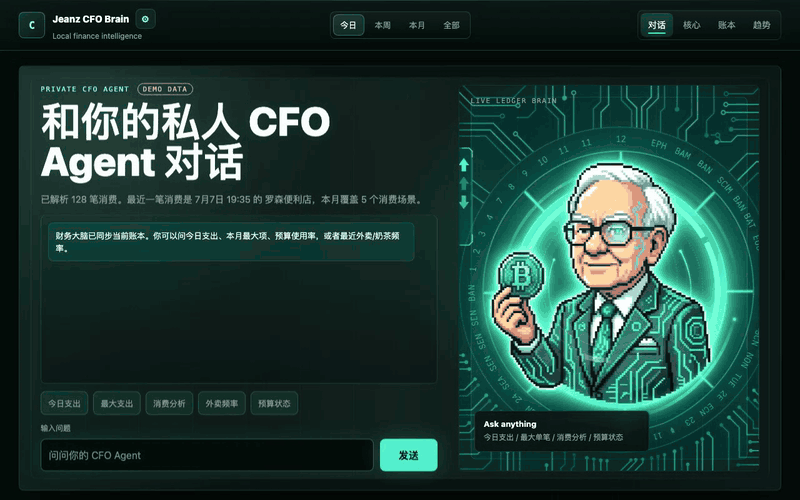

<div align="center">

[中文](README.md) · **English**


# Jeanz CFO Brain

**One tap after paying — your bills become a personal cash-flow system you can analyze and talk to.**

A local-first personal CFO agent:<br>
iPhone Shortcut captures a bill screenshot → local OCR & rule-based parsing on your Mac → structured SQLite ledger → web finance dashboard + LLM chat.

[](#-quick-start)
[](#-quick-start)
[](cfo_agent_poc/web_app)
[](#-design-highlights)
[](#-design-highlights)
[](LICENSE)

[Why](#-why-this-exists) · [How it works](#-the-journey-of-one-payment) · [Quick start](#-quick-start) · [Architecture](#%EF%B8%8F-architecture) · [Design highlights](#-design-highlights) · [Roadmap](#%EF%B8%8F-roadmap)



</div>

---

## 💡 Why this exists

The fundamental problem with expense-tracking apps is that **they need you to serve them**: open the app, pick a category, type the amount, add a note… The maintenance cost is so high that most people quit within three months — and once the data stream breaks, analysis is meaningless.

What we actually care about is rarely "how much did I spend today". It's questions that require **continuous observation**:

> - Which spending scenarios have been growing lately?
> - Are habits like food delivery, coffee, or parking quietly changing?
> - Did that big purchase squeeze my daily budget?
> - Is this month's budget pace still healthy?
> - Can I just *ask* my ledger instead of scrolling through statements?

So this project doesn't try to be another expense tracker you have to babysit. It automates **everything after a payment happens** — capture, structuring, categorization, analysis, Q&A. You tap one iPhone Shortcut after paying; machines do the rest.

```
The only thing you do:  pay → tap the Shortcut.
The system does:        receive screenshot → OCR → parse → categorize → store → analyze → answer your questions anytime.
```

## ✨ Features

| | Feature | Description |
|---|---|---|
| 📸 | **Near-zero-effort capture** | An iPhone Shortcut screenshots the bill page and emails it; the Mac pulls it via IMAP. No manual entry. |
| 🔍 | **Local OCR** | macOS Vision recognizes Chinese bill screenshots — free, offline, screenshots never leave your machine. |
| 🧾 | **Rule-based parsing** | Extracts amount, time, merchant, product, payment method, order ID, and infers a spending category. |
| 🧠 | **Finance dashboard** | Today / week / month / all periods in sync: total spend, category weights, cash-flow trends, budget progress. |
| 💬 | **A ledger you can talk to** | Powered by DeepSeek. Ask "what was my biggest expense this month?" — answers are grounded in your real ledger. |
| 🔗 | **Traceable evidence** | Every transaction keeps its original screenshot path and full OCR text. Bad parse? Trace back, fix the rule, re-run. |
| ♻️ | **Idempotent dedup** | A unique ID from the order number / content hash means re-syncing never double-books a transaction. |
| 🔐 | **Local-first** | The ledger lives in a local SQLite file, no third-party finance platform involved; public access requires a passphrase. |

## 🎬 The journey of one payment

Follow a single transaction and you understand the whole system:

<div align="center">

</div>

1. **Pay**, then open the bill detail page in WeChat / Alipay;
2. **Trigger the Shortcut** — it screenshots the page and emails it as an attachment (subject `CFO_CAPTURE_SCREENSHOT`);
3. Click **"Sync"** on the web page — the Mac scans unread mail via IMAP and downloads matching screenshots;
4. **Vision OCR** reads the screenshot; the raw text is archived under `data/ocr_texts/`;
5. **Rule-based parsing** extracts amount / time / merchant / category, builds a unique transaction ID, and **upserts into SQLite**;
6. The dashboard refreshes stats, ledger, trends, and budget progress;
7. When you ask a question, the server injects a **trimmed ledger context** into DeepSeek and returns an answer grounded in real data.

## 🚀 Quick start

### ⚡ Try it in 30 seconds (demo mode, zero config)

No mailbox, no API key, no Shortcut — a built-in fictional ledger shows you the whole product first:

```bash
git clone https://github.com/jeanzxiang-xjz/my-cfo-agent.git
cd my-cfo-agent
./cfo_agent_poc/start_cfo_web.sh --demo
```

Open [http://localhost:8091](http://localhost:8091): no login needed, 128 fictional transactions power the full dashboard, and the chat box answers questions (via built-in analysis when no LLM key is configured). Decide later whether to hook up your real bills.

### Requirements (only needed for real bills)

> Just browsing? Demo mode above only needs macOS + Python 3 + Node.js — no mailbox, no API key.

- **macOS** (OCR relies on the system Vision framework)
- Python 3
- Node.js / npm (to build the frontend)
- An IMAP-enabled mailbox and its authorization code (e.g. QQ Mail)
- A [DeepSeek API key](https://platform.deepseek.com/)

### 1. Clone & configure

```bash
git clone https://github.com/jeanzxiang-xjz/my-cfo-agent.git
cd my-cfo-agent
cp cfo_agent_poc/.env.example cfo_agent_poc/.env
```

Edit `cfo_agent_poc/.env`:

```bash
# Web access (a passphrase is mandatory before any public exposure)
CFO_ACCESS_TOKEN=your-passphrase
CFO_WEB_HOST=127.0.0.1
CFO_WEB_PORT=8091

# Ledger owner's name (shown on the login page, injected into the agent's system prompt)
CFO_OWNER_NAME=YourName

# Mail sync
CFO_MAIL_IMAP_HOST=imap.qq.com
CFO_MAIL_USER=your-email
CFO_MAIL_PASSWORD=your-imap-authorization-code
CFO_MAIL_MAILBOX=INBOX
CFO_MAIL_SUBJECT=CFO_CAPTURE_SCREENSHOT

# DeepSeek
DEEPSEEK_API_KEY=your-deepseek-key
DEEPSEEK_BASE_URL=https://api.deepseek.com
DEEPSEEK_MODEL=deepseek-v4-flash
```

> ⚠️ The real `.env` is excluded by `.gitignore` — never commit or publish it.

### 2. Set up the iPhone Shortcut

**Option 1 (recommended): install the ready-made one**

> [📲 Install the Shortcut with one tap](https://www.icloud.com/shortcuts/eb909451885a42208195397d54db34a0)

Open the link on your iPhone → add the Shortcut → open its editor and **change the "Send Email" recipient to your own sync mailbox** (the `CFO_MAIL_USER` from `.env`) — done.

**Option 2: build it yourself**

It only does two things ([step-by-step guide](cfo_agent_poc/docs/shortcut-setup.md)):

1. **Screenshot** the current screen;
2. Send the screenshot as an **email attachment** to your sync mailbox, subject `CFO_CAPTURE_SCREENSHOT` (must match `CFO_MAIL_SUBJECT` in `.env`).

**Daily use**: pay → open the bill detail page (make sure amount / time / product / payment method are visible) → trigger the Shortcut. Tip: add it to your home screen, or bind it to double Back Tap.

### 3. Launch

```bash
./cfo_agent_poc/start_cfo_web.sh
```

The script reads `.env`, builds the frontend if needed, and starts the server. Open [http://localhost:8091](http://localhost:8091) and enter your passphrase.

### Daily usage

| Action | Effect |
|---|---|
| Click "Sync" | Pull the latest bill screenshots from mail into the ledger |
| Switch period at the top | Today / week / month / all views refresh together |
| "Core" section | Period total, biggest single expense, category weights, behavior analysis |
| "Ledger" section | Transaction stream with category filters and pagination |
| "Trends" modal | Daily/weekly/monthly cash-flow curves and budget usage |
| Gear button | Configure daily / weekly / monthly budgets |
| Chat box | "How much did I spend today?" "Am I ordering too much delivery?" |

<details>
<summary><b>More commands (manual processing / backup / public demo)</b></summary>

```bash
# Process one bill screenshot without going through mail
cd cfo_agent_poc
python3 process_bill_image.py /path/to/bill.png --source manual --source-hint alipay
python3 web_app/generate_snapshot.py   # regenerate the static snapshot

# Back up the database (written to data/backups/)
./cfo_agent_poc/backup_cfo_db.sh

# Temporary public demo (cloudflared tunnel; CFO_ACCESS_TOKEN required)
./cfo_agent_poc/start_public_demo.sh

# Health check
curl http://127.0.0.1:8091/health
```

</details>

## 🏗️ Architecture

<div align="center">

</div>

| Layer | Responsibility | Main components |
|---|---|---|
| ① Mobile capture | Screenshot the bill page and email it | iOS Shortcut |
| ② Local processing (Mac) | Pull mail, OCR, parse & store, serve | `mail_sync.py` · `ocr_image.swift` · `bill_store.py` · `server.py` |
| ③ Data & intelligence | Evidence + structured transactions, LLM chat | SQLite `cfo.sqlite` · DeepSeek |
| ④ Presentation & access | Finance dashboard and access control | React 19 + Vite · passphrase auth |

**Deliberate trade-offs:**

- **Capture via "Shortcut + email" instead of a mobile app** — lowest possible cost for a personal setup, and the phone never needs to reach any HTTP endpoint; screenshots ride the mailbox ecosystem.
- **macOS Vision instead of cloud OCR** — local, free, great at Chinese bills; screenshots never leave the machine.
- **Rule-based parsing instead of letting an LLM write to the DB** — bill layouts are stable; rules are controllable, explainable, and cost zero tokens. The LLM only handles the conversation layer.
- **Python stdlib + SQLite backend** — a private local service doesn't need a heavy framework; a single-file database is easy to back up and query with plain SQL.

## 🧩 Design highlights

### Raw evidence separated from structured results

<div align="center">

</div>

`transactions` holds structured records (the UI and chat read from it); `raw_bill_captures` holds original screenshots and full OCR text. Each transaction points back to its evidence via `raw_capture_hash` — **a bad parse can always be traced to the original screenshot**, rules can be fixed and re-run, and display fields (`merchant`/`thing`) can be corrected without touching the evidence.

### Idempotent dedup

Every transaction gets a `transaction_uid`: the order number from the bill when available, otherwise a hash of "source + amount + time + product + payment method". Writes are upserts keyed on this ID — **the same email or screenshot synced twice never books twice**.

### Confidence scoring

Every parse carries a confidence score, accumulated per extracted field (amount, time, status, merchant, category…). Low-confidence transactions prompt you to check the original screenshot instead of silently swallowing suspicious data.

### Trimmed context injection

<div align="center">

</div>

The server never dumps the whole database into the LLM. It builds a trimmed context — current-period stats, monthly summary, recent transactions (max 40), your budget config. The system prompt is explicit: **answer only from the provided context, admit when data is insufficient, never invent transactions.**

## 🔐 Security & privacy

- Ledger, screenshots, and OCR text **all stay on your machine by default** — no third-party finance platform, inspect or delete anytime.
- DeepSeek only receives the **trimmed** ledger context when you start a conversation; it never touches the database file.
- Without `CFO_ACCESS_TOKEN`, public access is **refused**; with it, the page requires login and the API accepts Cookie / Bearer / custom-header auth.
- `.env` (mail credentials, API keys) and `data/` (database, screenshots, OCR text) are excluded via `.gitignore`.

> Known boundary: the chat path still sends partial transaction context to DeepSeek. For full offline operation, swap in a local LLM (see Roadmap).

## 🗺️ Roadmap

- [ ] Edit `merchant` / `thing` / `category` directly in the web UI
- [ ] LLM-assisted categorization (with rule fallback and manual confirmation)
- [ ] Daily Morning Brief: yesterday's spend, budget pace, anomaly alerts
- [ ] More capture sources: bank SMS, Apple Wallet, credit-card statement emails
- [ ] Local LLM support for fully offline operation
- [ ] Data export: CSV / monthly Markdown reports
- [ ] Per-scenario budgets: dining, entertainment, big-ticket items

## 📚 More docs

- [CFO agent system prompt](cfo_agent_poc/prompts/cfo_system_prompt.md)
- [iPhone Shortcut setup guide](cfo_agent_poc/docs/shortcut-setup.md)

## 🤝 Contributing

This project grew out of a real personal need. Issues, PRs, and ideas are all welcome — especially new bill-parsing rules, new capture sources, and local-LLM integrations.

## 📄 License

[MIT](LICENSE)

---

<div align="center">

**If this project inspired you, a ⭐️ means a lot.**

*Let the ledger speak for itself, instead of you serving the ledger.*

</div>
