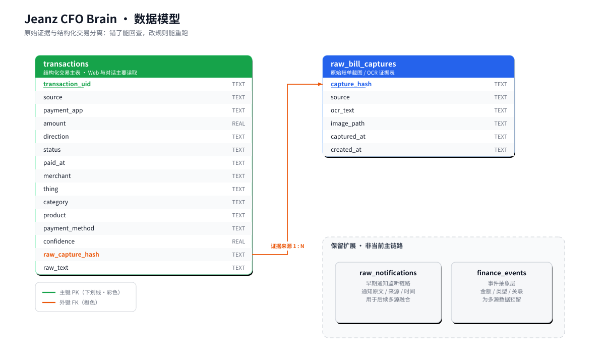
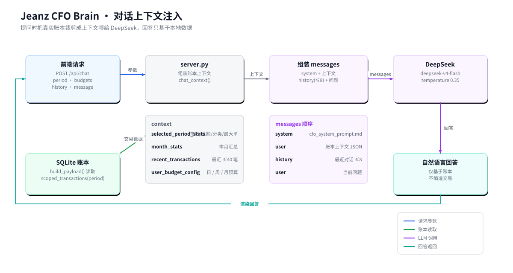

<div align="center">


# Jeanz CFO Brain

**支付后点一下，账单自动变成能分析、能追问的个人现金流系统。**

一个本地优先（Local-first）的私人财务 CFO Agent：<br>
iPhone 快捷指令捕获账单截图 → Mac 本地 OCR 与规则解析 → SQLite 结构化账本 → Web 财务大脑 + LLM 对话。

[](#-快速上手)
[](#-快速上手)
[](cfo_agent_poc/web_app)
[](#-设计亮点)
[](#-设计亮点)
[](LICENSE)

[为什么做它](#-为什么做它) · [工作原理](#-一笔钱的旅程) · [快速上手](#-快速上手) · [架构](#-系统架构) · [设计亮点](#-设计亮点) · [Roadmap](#%EF%B8%8F-roadmap)

</div>

---

## 💡 为什么做它

传统记账工具的根本问题是——**要人主动记**。打开 App、选分类、输金额、补备注……维护成本太高，绝大多数人坚持不了三个月，数据一断，分析就无从谈起。

而我们真正关心的，往往也不是「今天花了多少」这一个数字，而是一些需要**持续观察**才能回答的问题：

> - 最近哪些消费场景变多了？
> - 外卖、咖啡、停车这些习惯有没有悄悄变化？
> - 那笔大额支出，是不是挤占了日常预算？
> - 这个月的预算节奏还健康吗？
> - 能不能直接用一句话问账本，而不是自己翻流水？

所以这个项目不打算再做一个「需要你伺候」的记账软件，而是把**消费发生之后的一切**——数据发现、结构化、归类、分析、问答——尽量自动化。你只在支付后点一下 iPhone 快捷指令，剩下的交给机器。

```
你唯一要做的事：支付 → 点一下快捷指令。
系统替你做的事：收截图 → OCR → 解析 → 分类 → 入库 → 分析 → 随时回答你的提问。
```

## ✨ 特性一览

| | 特性 | 说明 |
|---|---|---|
| 📸 | **近乎无感的采集** | iPhone 快捷指令对账单页截图并邮件发出，Mac 端 IMAP 自动拉取，无需手动录入 |
| 🔍 | **本地 OCR** | 调用 macOS Vision 识别中文账单截图，免费、离线、截图不出本机 |
| 🧾 | **规则化解析** | 自动抽取金额、时间、商户、商品、支付方式、订单号，并识别消费场景分类 |
| 🧠 | **财务大脑 Web UI** | 今日/本周/本月/全部四周期联动：总支出、场景权重、现金流趋势、预算进度 |
| 💬 | **可对话的账本** | 接入 DeepSeek，直接问「这个月最大的支出是什么」，回答基于真实账本数据 |
| 🔗 | **证据可追溯** | 每笔交易保留原始截图路径与 OCR 全文，解析错了能回查、改规则重跑 |
| ♻️ | **幂等去重** | 基于交易单号/内容哈希生成唯一 ID，重复同步不会重复记账 |
| 🔐 | **本地优先** | 账本存本机 SQLite，不依赖任何第三方记账平台；公网访问强制口令保护 |

## 🎬 一笔钱的旅程

跟着一笔交易走一遍，就理解了整个系统：

<div align="center">

</div>

1. **支付完成**，打开微信/支付宝的账单详情页；
2. **触发快捷指令**——截图，并把截图作为邮件附件发到同步邮箱（主题 `CFO_CAPTURE_SCREENSHOT`）；
3. 在网页上点**「消费数据同步」**，Mac 端通过 IMAP 扫描未读邮件、下载命中的截图；
4. **Vision OCR** 识别截图，原文留档到 `data/ocr_texts/`；
5. **规则解析**出金额、时间、商户、分类等字段，生成交易唯一 ID，**幂等写入 SQLite**；
6. 网页刷新统计、流水、趋势与预算进度；
7. 你提问时，服务端把**裁剪过的账本上下文**注入给 DeepSeek，返回基于真实数据的分析。

## 🚀 快速上手

### 环境要求

- **macOS**（OCR 依赖系统 Vision 框架）
- Python 3
- Node.js / npm（用于构建前端）
- 一个开通了 IMAP 的邮箱及授权码（如 QQ 邮箱）
- 一个 [DeepSeek API Key](https://platform.deepseek.com/)

### 1. 克隆并配置

```bash
git clone https://github.com/<your-name>/jeanz-cfo-brain.git
cd jeanz-cfo-brain
cp cfo_agent_poc/.env.example cfo_agent_poc/.env
```

编辑 `cfo_agent_poc/.env`：

```bash
# Web 访问（公网暴露前必须设置口令）
CFO_ACCESS_TOKEN=你的访问口令
CFO_WEB_HOST=127.0.0.1
CFO_WEB_PORT=8091

# 邮箱同步
CFO_MAIL_IMAP_HOST=imap.qq.com
CFO_MAIL_USER=你的邮箱
CFO_MAIL_PASSWORD=你的IMAP授权码
CFO_MAIL_MAILBOX=INBOX
CFO_MAIL_SUBJECT=CFO_CAPTURE_SCREENSHOT

# DeepSeek
DEEPSEEK_API_KEY=你的DeepSeek密钥
DEEPSEEK_BASE_URL=https://api.deepseek.com
DEEPSEEK_MODEL=deepseek-v4-flash
```

> ⚠️ 真实的 `.env` 已被 `.gitignore` 排除，请勿提交或公开。

### 2. 设置 iPhone 快捷指令

创建一个只做两件事的快捷指令：

1. 对当前屏幕**截图**；
2. 把截图作为**邮件附件**发送到上面配置的邮箱，主题填 `CFO_CAPTURE_SCREENSHOT`。

使用时：支付 → 打开账单详情页（确认包含金额/时间/商品/支付方式）→ 触发快捷指令。

### 3. 启动

```bash
./cfo_agent_poc/start_cfo_web.sh
```

脚本会自动读取 `.env`、按需构建前端并启动服务。打开 [http://localhost:8091](http://localhost:8091)，输入访问口令即可进入。

### 日常使用

| 操作 | 效果 |
|---|---|
| 点「消费数据同步」 | 拉取最新邮件截图并写入账本 |
| 顶部切换周期 | 今日 / 本周 / 本月 / 全部联动刷新 |
| 「核心」区域 | 当前周期总支出、最大单笔、消费场景权重与行为分析 |
| 「账本」区域 | 交易流水，按分类筛选、分页查看 |
| 「趋势」弹窗 | 日/周/月现金流折线与预算使用率 |
| 齿轮按钮 | 配置日 / 周 / 月预算 |
| 对话框 | 「我今天花了多少钱？」「最近外卖是不是点多了？」 |

<details>
<summary><b>更多命令（手动处理截图 / 备份 / 公网演示）</b></summary>

```bash
# 不走邮箱，手动处理一张账单截图
cd cfo_agent_poc
python3 process_bill_image.py /path/to/bill.png --source manual --source-hint alipay
python3 web_app/generate_snapshot.py   # 重新生成静态快照

# 备份数据库（写入 data/backups/）
./cfo_agent_poc/backup_cfo_db.sh

# 临时公网演示（cloudflared 隧道，必须先配置 CFO_ACCESS_TOKEN）
./cfo_agent_poc/start_public_demo.sh

# 健康检查
curl http://127.0.0.1:8091/health
```

</details>

## 🏗️ 系统架构

<div align="center">

</div>

| 层 | 职责 | 主要组件 |
|---|---|---|
| ① 移动端采集层 | 在账单页截图并发邮件 | iOS 快捷指令 |
| ② Mac 本地处理层 | 拉邮件、OCR、解析入库、服务编排 | `mail_sync.py` · `ocr_image.swift` · `bill_store.py` · `server.py` |
| ③ 数据与智能层 | 存证据与结构化交易、LLM 对话 | SQLite `cfo.sqlite` · DeepSeek |
| ④ 展示与访问层 | 财务大脑页面与访问控制 | React 19 + Vite · 口令认证 |

**几个刻意的技术取舍：**

- **采集用「快捷指令 + 邮件」而不是写手机 App**——私人场景下开发成本最低，且不需要向手机端暴露任何 HTTP 接口，截图借邮箱生态传递即可。
- **OCR 用 macOS Vision 而不是云端 OCR**——本地、免费、中文账单识别质量好，截图永远不出本机。
- **入库用规则解析而不是让 LLM 直接写库**——账单字段结构稳定，规则更可控、可解释、零 token 成本；大模型只负责「对话分析」这一层。
- **后端用 Python 标准库 + SQLite**——本地私有服务不需要重框架，单文件数据库好备份、可直接用 SQL 查询。

## 🧩 设计亮点

### 原始证据与结构化结果分离

<div align="center">

</div>

`transactions` 存结构化交易（页面和对话读它），`raw_bill_captures` 存原始截图与 OCR 全文。交易通过 `raw_capture_hash` 指回证据表——**解析错了永远能回溯到原始截图**，改完规则可以重跑，展示字段（`merchant`/`thing`）随时可修正而不破坏证据。

### 幂等去重

每笔交易生成一个 `transaction_uid`：优先取账单里的交易单号；没有单号时对「来源 + 金额 + 时间 + 商品 + 支付方式」做哈希。写库按此 ID upsert——**同一封邮件、同一张截图重复同步，也不会重复记账**。

### 置信度打分

每条解析结果附带置信度：命中金额、时间、状态、商户、分类等字段逐项加分。低置信度的交易会提示你回查原始截图，而不是默默吞掉一条可疑数据。

### 裁剪式上下文注入

<div align="center">

</div>

提问时服务端不会把整个数据库甩给大模型，而是构造一份裁剪过的上下文：当前周期统计、本月汇总、最近交易（上限 40 笔）、你的预算配置。系统提示词明确要求：**只基于上下文回答，数据不足就直说，不编造账本里不存在的交易。**

## 🔐 安全与隐私

- 账本、截图、OCR 文本**默认全部存本机**，不依赖第三方记账平台，随时可自查、可删除。
- DeepSeek 只在你发起对话时接收**裁剪过的**账本上下文，不直接接触数据库文件。
- 未配置 `CFO_ACCESS_TOKEN` 时**禁止公网访问**；配置后页面需登录，API 支持 Cookie / Bearer / 自定义 Header 三种认证。
- `.env`（邮箱授权码、API Key）与 `data/`（数据库、截图、OCR 文本）均已在 `.gitignore` 中排除。

> 已知边界：对话链路仍会把部分交易上下文发给 DeepSeek。若需要完全本地化，可将 LLM 替换为本地模型（见 Roadmap）。

## 🗺️ Roadmap

- [ ] 网页上直接编辑 `merchant` / `thing` / `category`
- [ ] LLM 辅助分类（保留规则兜底与人工确认）
- [ ] 每日 Morning Brief：昨日支出、预算进度、异常消费提醒
- [ ] 更多采集源：银行短信、Apple Wallet、信用卡邮件账单
- [ ] 本地 LLM 支持，实现完全离线
- [ ] 数据导出：CSV / 月度 Markdown 报告
- [ ] 分场景预算：餐饮、娱乐、大额专项

## 📚 更多文档

- [项目介绍（面向初次接触者的完整导读）](cfo_agent_poc/docs/INTRODUCTION.md)
- [项目说明书（字段、表结构、解析逻辑等规格细节）](cfo_agent_poc/README.md)
- [CFO Agent 系统提示词](cfo_agent_poc/prompts/cfo_system_prompt.md)

## 🤝 贡献

这是一个从真实个人需求长出来的项目。Issue、PR、想法讨论都欢迎——尤其是新的账单解析规则、新的采集源接入和本地 LLM 方案。

## 📄 License

[MIT](LICENSE)

---

<div align="center">

**如果这个项目给了你启发，欢迎点一个 ⭐️**

*让账本自己说话，而不是让你伺候账本。*

</div>
