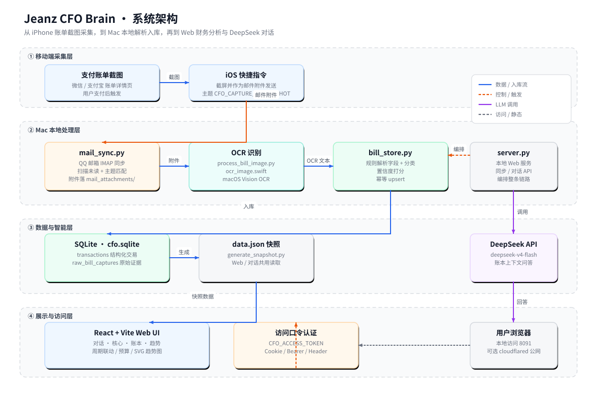
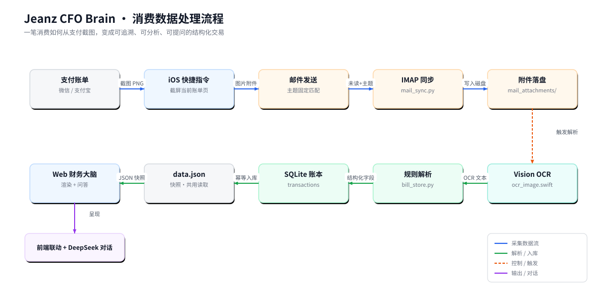

# Jeanz CFO Brain 项目说明书

Jeanz CFO Brain 是一个私人化的个人财务 CFO Agent 原型。它的目标不是再做一个需要用户手动维护的记账软件，而是尽量把“消费发生后的数据发现、结构化、归类、分析和问答”自动化，让个人账本变成一个可以持续理解现金流的智能系统。

当前版本围绕 iPhone 支付账单截图、邮箱同步、Mac 本地 OCR、SQLite 本地账本、Web 财务大脑和 DeepSeek 对话构建，适合个人或小范围朋友私有使用。

## 1. 需求背景

传统记账工具的核心问题是“人要主动记”。用户需要打开 App、选择分类、输入金额、补充备注，长期维护成本很高。对个人消费分析而言，用户真正关心的也不只是“今天花了多少钱”，而是：

- 最近哪些消费场景变多了；
- 外卖、咖啡、停车、娱乐等习惯是否出现变化；
- 大额支出是否挤占了日常预算；
- 本月预算节奏是否健康；
- 能否直接用自然语言追问账本，而不是翻流水。

因此本项目的设计目标是：让用户在尽量无感知的情况下，把支付后账单转化为可分析的结构化记录，并通过 Agent 主动分析和随时对话降低记账负担。

## 2. 需求目标

### 2.1 自动采集优先

消费发生后，用户不需要手动输入金额、商户、分类。当前版本采用“iOS 快捷指令截屏 + 邮件附件 + Mac 端同步解析”的方式，把高频支付账单截图接入本地账本。

### 2.2 理解消费内容

系统不只保存金额，还会尝试识别：

- 支付渠道：微信、支付宝等；
- 消费时间、金额、状态；
- 商户名称、商品说明、支付方式；
- 消费场景分类，例如外卖/餐饮、咖啡/奶茶、停车交通、教育考试、图书书店等；
- 原始 OCR 文本和截图路径，用于后续追溯和修正。

### 2.3 持续分析现金流

Web 页面按今日、本周、本月、全部四个周期联动展示：

- 周期总支出；
- 消费笔数；
- 最大单笔；
- 消费场景权重；
- Agent 对消费行为的规则分析；
- 日、周、月维度现金流趋势；
- 日、周、月预算使用情况。

### 2.4 随时自然语言对话

Command Console 接入 DeepSeek。用户可以直接问：

- “我今天花了多少钱？”
- “这个月最大的支出是什么？”
- “分析下我目前的消费情况”
- “我最近点的外卖是不是太多？”
- “预算使用率是多少？”

服务端会把本地账本上下文、周期统计、最近交易和预算配置注入给大模型，让回答基于真实账本数据。

## 3. 当前功能点

### 3.1 消费数据采集

- iPhone 端通过快捷指令对当前账单详情页截图。
- 快捷指令将截图作为邮件附件发送到指定邮箱。
- 邮件主题固定为 `CFO_CAPTURE_SCREENSHOT`，方便 Mac 端精确筛选。
- Web 页面中的“消费数据同步”按钮会触发 IMAP 扫描未读邮件。
- 命中的图片附件会保存到 `data/mail_attachments/`。

### 3.2 OCR 与账单解析

- `process_bill_image.py` 调用 `ocr_image.swift`，使用 macOS Vision OCR 识别账单截图。
- OCR 文本保存到 `data/ocr_texts/`。
- `bill_store.py` 从 OCR 文本中解析金额、时间、状态、商户、商品说明、支付方式、订单号等字段。
- 解析后的数据写入 SQLite。
- 原始 OCR 全文保存在 `raw_text` 中，便于后续修正解析规则。

### 3.3 分类与消费理解

当前分类采用规则匹配，集中维护在 `bill_store.py` 的 `CATEGORY_RULES` 中。系统会根据商品说明、商户和 OCR 全文识别消费场景，例如：

- `food_delivery`：外卖/餐饮；
- `coffee_tea`：咖啡/奶茶；
- `parking`：停车交通；
- `groceries`：超市便利；
- `books`：图书书店；
- `entertainment`：演出票务；
- `utilities`：水电燃缴费；
- `investment`：投资理财；
- `uncategorized`：未识别分类。

分类结果会影响财务智能核心、交易流水筛选、趋势分析和 LLM 对话上下文。

### 3.4 Web 财务大脑

Web 前端包含四个核心区域：

- **对话**：CFO Agent 对话区，支持快速提问和自由输入。
- **核心**：展示周期支出、消费笔数、最大单笔、置信度、消费场景权重和行为分析。
- **账本**：展示交易流水，支持分类筛选和分页。
- **趋势**：弹窗展示日/周/月现金流折线图和预算使用情况。

### 3.5 预算配置

右上角齿轮按钮可以配置：

- 日预算；
- 周预算；
- 月预算。

预算配置保存在浏览器 `localStorage` 中，并会被趋势弹窗和 DeepSeek 对话上下文使用。

### 3.6 DeepSeek 对话

服务端 `/api/chat` 会读取本地账本，构造上下文后调用 DeepSeek：

- 默认模型：`deepseek-v4-flash`；
- 系统提示词：`prompts/cfo_system_prompt.md`；
- 上下文包括当前周期统计、本月统计、最近交易、用户预算配置；
- 回答要求基于本地账本，不编造账本不存在的交易。

### 3.7 访问保护

Web 服务支持访问口令：

- 未配置 `CFO_ACCESS_TOKEN` 时，不允许公网访问；
- 配置后，访问页面需要登录；
- API 支持 Cookie、`Authorization: Bearer` 或 `X-CFO-Access-Token` 认证。

## 4. 系统架构



当前架构分为四层：

- **移动端采集层**：用户在微信/支付宝账单页触发 iOS 快捷指令，生成截图并发送邮件。
- **Mac 本地处理层**：Mac Web 服务连接邮箱、下载附件、OCR、解析账单。
- **数据与智能层**：SQLite 保存原始证据和结构化交易；DeepSeek 使用账本上下文回答问题。
- **展示与访问层**：React/Vite Web UI 提供对话、核心分析、账本流水、趋势与预算配置。

## 5. 消费数据处理流程



单笔交易的典型链路如下：

1. 用户完成支付，打开微信或支付宝账单详情页。
2. 在 iPhone 上触发快捷指令，快捷指令截图并发送邮件。
3. Web 页面点击“消费数据同步”。
4. `server.py` 调用 `mail_sync.py`，通过 IMAP 扫描未读邮件。
5. 邮件主题匹配 `CFO_CAPTURE_SCREENSHOT` 后，附件保存到 `data/mail_attachments/`。
6. `process_bill_image.py` 调用 macOS Vision OCR，输出 OCR 文本。
7. OCR 文本保存到 `data/ocr_texts/`。
8. `bill_store.py` 解析字段、识别分类、生成 `transaction_uid`。
9. 结构化交易写入 SQLite。
10. Web UI 读取 `/data.json`，刷新分析和流水。
11. 用户提问时，服务端把账本上下文传给 DeepSeek，返回自然语言分析。

## 6. 技术选型

### 6.1 数据采集

- **iOS 快捷指令**：降低手机端开发成本，适合私人使用场景。
- **邮件附件**：使用 Apple/邮箱生态传递截图，避免暴露 HTTP 接口给手机端。
- **QQ 邮箱 IMAP**：Mac 端通过授权码读取指定主题邮件。

### 6.2 OCR

- **macOS Vision OCR**：通过 Swift 脚本调用系统 OCR 能力，适合本地处理中文账单截图。
- **本地 OCR 文本留存**：每张截图识别后的文本单独保存，便于排查解析错误。

### 6.3 后端与数据

- **Python 标准库 HTTP Server**：轻量、够用，适合本地私有服务。
- **SQLite**：单机本地账本，部署简单、可备份、可直接查询。
- **规则解析**：当前账单字段结构较稳定，规则解析比直接让 LLM 入库更可控。

### 6.4 前端

- **React + Vite**：构建页面结构和交互。
- **原生 JS 控制器**：负责账本数据渲染、趋势图、预算配置和对话请求。
- **GSAP + ScrollTrigger**：用于页面动效和模块入场动画。
- **SVG 折线图**：现金流趋势直接由前端生成。

### 6.5 大模型

- **DeepSeek API**：用于自然语言消费分析。
- **System Prompt 文件化**：`prompts/cfo_system_prompt.md` 可独立维护 CFO Agent 的回答边界和风格。

## 7. 详细设计

### 7.1 目录结构

```text
cfo_agent_poc/
  bill_store.py              # OCR 文本解析、分类、入库
  process_bill_image.py      # 图片 OCR 入口
  ocr_image.swift            # macOS Vision OCR 脚本
  mail_sync.py               # IMAP 邮箱同步
  start_cfo_web.sh           # 构建并启动 Web 服务
  start_public_demo.sh       # 可选公网暴露脚本
  backup_cfo_db.sh           # SQLite 备份脚本
  prompts/
    cfo_system_prompt.md     # CFO Agent 系统提示词
  data/
    cfo.sqlite               # 本地账本数据库
    mail_attachments/        # 邮件截图附件
    ocr_texts/               # OCR 原始文本
    backups/                 # 数据库备份
  web_app/
    server.py                # Web 服务、认证、同步、对话 API
    generate_snapshot.py     # 生成静态 data.json 快照
    data.json                # Web 静态快照文件
    src/                     # React 页面与前端控制逻辑
    assets/                  # Hero 图等静态资源
    dist/                    # Vite 构建产物
```

### 7.2 数据表设计

核心数据库是 `data/cfo.sqlite`。

#### `transactions`

结构化交易主表，Web 页面和 DeepSeek 上下文主要读取它。

关键字段：

- `transaction_uid`：交易唯一 ID，优先基于交易单号生成；没有交易单号时基于来源、金额、时间、商品、支付方式生成哈希。
- `payment_app`：支付来源，例如 `wechat`、`alipay`、`wallet`。
- `amount`：金额。
- `direction`：资金方向，`outflow` 或 `inflow`。
- `status`：交易状态，例如 `paid`、`refunded`、`failed`。
- `paid_at`：支付时间。
- `merchant`：面向页面展示的商户名称。
- `thing`：系统理解出的消费内容，例如“奶茶”“饭”“图书”。
- `category`：消费场景分类。
- `product`：账单原始商品说明字段。
- `payment_method`：支付方式，例如银行卡、花呗等。
- `raw_text`：OCR 原始全文，用于追溯。
- `confidence`：解析置信度。

#### `raw_bill_captures`

原始账单截图/OCR 证据表。

关键字段：

- `capture_hash`：截图/OCR 记录哈希；
- `source`：来源，例如 `email_screenshot`；
- `ocr_text`：OCR 原文；
- `image_path`：截图附件路径；
- `captured_at`：邮件或截图捕获时间。

#### `raw_notifications` / `finance_events`

早期通知链路和事件抽象表，目前不是主链路，但保留用于后续扩展通知监听或多源数据融合。

### 7.3 字段理解逻辑

解析策略集中在 `bill_store.py`：

- `extract_amount()`：识别金额。
- `extract_paid_at()`：识别支付时间，支持中文日期和 `YYYY-MM-DD HH:mm:ss`。
- `extract_status()`：识别支付成功、退款、失败等状态。
- `first_field()` / `extract_field()`：根据账单字段标签抽取商品说明、支付方式、交易单号等。
- `detect_payment_app()`：根据截图文本和来源 hint 判断微信、支付宝或 Wallet。
- `detect_merchant()`：优先取商户全称，其次从账单头部或商品说明推断。
- `detect_category_and_thing()`：根据 `CATEGORY_RULES` 识别分类和消费内容。
- `build_transaction_uid()`：生成交易唯一 ID，用于去重和幂等入库。

### 7.4 前端数据联动

前端通过 `/data.json` 获取交易列表，并在浏览器内完成：

- 周期筛选：今日、本周、本月、全部；
- 汇总计算：总支出、消费笔数、最大单笔、分类权重；
- 账本分页：交易流水默认每页 10 条；
- 分类筛选：按消费场景过滤流水；
- 趋势图：日维度展示近 7 天，周维度展示本月周趋势，月维度展示本年月至今趋势；
- 预算：日/周/月预算存储在 `localStorage`，并参与趋势和对话上下文。

### 7.5 LLM 对话上下文

用户提问时，前端调用 `/api/chat`。服务端会构造如下上下文：

- `selected_period`：当前选中的周期；
- `user_budget_config`：用户配置的日、周、月预算；
- `selected_period_stats`：当前周期交易笔数、总支出、分类汇总、最大单笔；
- `month_stats`：本月汇总；
- `recent_transactions`：最近若干笔交易。

模型被要求只基于上下文回答；如果数据不足，需要明确说明样本不足。

## 8. 使用说明

### 8.1 iPhone 快捷指令使用

快捷指令只做两件事：

1. 对当前账单详情页截图。
2. 将截图作为邮件附件发送到同步邮箱，邮件主题为：

```text
CFO_CAPTURE_SCREENSHOT
```

建议使用方式：

- 支付后打开微信或支付宝账单详情页；
- 确认页面包含金额、支付时间、商品说明、支付方式等字段；
- 触发快捷指令；
- 等待邮件发送完成。

### 8.2 Web 页面使用

启动服务后访问：

```bash
http://localhost:8091/
```

常用操作：

- 点击“消费数据同步”：拉取最新邮件截图并写入账本。
- 使用顶部周期切换：查看今日、本周、本月、全部数据。
- 查看“财务智能核心”：理解当前周期主要支出与消费场景。
- 查看“交易流水”：按分类筛选具体交易。
- 点击“趋势”：查看日/周/月现金流和预算使用率。
- 点击齿轮：维护日、周、月预算。
- 在对话框输入问题：让 CFO Agent 基于本地账本回答。

### 8.3 手动处理单张图片

如果不走邮箱，也可以手动处理图片：

```bash
python3 cfo_agent_poc/process_bill_image.py /path/to/bill.png --source manual --source-hint alipay
```

处理后可重新生成静态快照：

```bash
python3 cfo_agent_poc/web_app/generate_snapshot.py
```

### 8.4 备份数据库

```bash
./cfo_agent_poc/backup_cfo_db.sh
```

备份文件会写入：

```text
cfo_agent_poc/data/backups/
```

## 9. 部署说明

### 9.1 环境要求

- macOS；
- Python 3；
- Swift/macOS Vision OCR 可用；
- Node.js/npm，或使用项目内置 Node 路径；
- 可用的邮箱 IMAP 授权码；
- DeepSeek API Key；
- 本地浏览器访问权限。

### 9.2 配置 `.env`

在 `cfo_agent_poc/.env` 中配置以下变量。不要把真实 `.env` 提交或公开。

```bash
# Web 访问
CFO_ACCESS_TOKEN=你的访问口令
CFO_WEB_HOST=127.0.0.1
CFO_WEB_PORT=8091

# 邮箱同步
CFO_MAIL_IMAP_HOST=imap.qq.com
CFO_MAIL_USER=你的邮箱
CFO_MAIL_PASSWORD=你的IMAP授权码
CFO_MAIL_MAILBOX=INBOX
CFO_MAIL_SUBJECT=CFO_CAPTURE_SCREENSHOT

# DeepSeek
DEEPSEEK_API_KEY=你的DeepSeek密钥
DEEPSEEK_BASE_URL=https://api.deepseek.com
DEEPSEEK_MODEL=deepseek-v4-flash
DEEPSEEK_THINKING=disabled
```

### 9.3 启动本地服务

在项目根目录执行：

```bash
./cfo_agent_poc/start_cfo_web.sh
```

脚本会自动：

1. 读取 `cfo_agent_poc/.env`；
2. 检查前端是否需要构建；
3. 必要时执行 Vite build；
4. 启动 Python Web 服务；
5. 默认监听 `127.0.0.1:8091`。

### 9.4 手动构建前端

```bash
export PATH="$PWD/cfo_agent_poc/bin/node/bin:$PATH"
npm --prefix cfo_agent_poc/web_app run build
```

### 9.5 公网访问

项目提供 `start_public_demo.sh`，用于通过 `cloudflared` 暴露本地服务。公网访问前必须配置 `CFO_ACCESS_TOKEN`。

```bash
./cfo_agent_poc/start_public_demo.sh
```

公网暴露只建议临时演示使用。私人财务数据敏感，长期使用建议仅保留本地访问，或放在可信 VPN/内网环境。

## 10. 安全与隐私设计

- 账本数据默认保存在本机 SQLite，不依赖第三方记账平台。
- 图片附件和 OCR 文本保存在本地目录，便于自查和删除。
- DeepSeek 只在用户发起对话时接收经过裁剪的账本上下文，不直接读取数据库文件。
- 访问页面需要 `CFO_ACCESS_TOKEN`。
- 邮箱授权码和 DeepSeek Key 存在 `.env`，不应提交到公开仓库。

需要注意的是，当前链路仍会把部分交易上下文发送给 DeepSeek 用于问答。如果希望完全本地化，需要后续替换为本地 LLM。

## 11. 当前边界与限制

- 手机侧仍需要用户触发快捷指令，不是完全后台无感采集。
- 邮箱同步默认扫描未读邮件；如果邮件被提前标记已读，可能不会被同步。
- OCR 质量受截图清晰度、页面布局和系统识别能力影响。
- 分类当前是规则驱动，遇到新商户或新消费场景需要补充规则。
- DeepSeek 对话依赖外部 API 和网络。
- 预算配置目前保存在浏览器本地，换浏览器或清理缓存后需要重新设置。
- `product/raw_text` 保留原始证据，不建议直接覆盖；展示名称优先修改 `merchant/thing`。

## 12. 后续演进方向

可继续演进的方向包括：

- 增加交易编辑界面，支持在 Web 上修正 `merchant`、`thing`、`category`。
- 引入 LLM 辅助分类，但保留规则兜底和人工确认机制。
- 增加每日 Morning Brief，自动生成昨日支出、预算进度和异常消费提醒。
- 支持更多采集源，例如银行短信、Apple Wallet、信用卡邮件账单。
- 支持本地模型，减少隐私数据发送到外部 API。
- 增加数据导出，例如 CSV、月度报告 Markdown 或 PDF。
- 增加更细的预算体系，例如餐饮预算、娱乐预算、大额支出专项预算。

## 13. 快速命令索引

```bash
# 启动 Web 服务
./cfo_agent_poc/start_cfo_web.sh

# 手动构建前端
export PATH="$PWD/cfo_agent_poc/bin/node/bin:$PATH"
npm --prefix cfo_agent_poc/web_app run build

# 手动处理一张账单截图
python3 cfo_agent_poc/process_bill_image.py /path/to/bill.png --source manual --source-hint alipay

# 重新生成静态快照
python3 cfo_agent_poc/web_app/generate_snapshot.py

# 备份数据库
./cfo_agent_poc/backup_cfo_db.sh

# 健康检查
curl http://127.0.0.1:8091/health
```

## 14. 项目一句话总结

Jeanz CFO Brain 是一个本地优先的私人财务 Agent：它用 iPhone 快捷指令捕获账单截图，用 Mac 本地 OCR 和规则解析生成结构化账本，再通过 Web 财务大脑和 DeepSeek 对话，把日常消费流水转化为可追溯、可分析、可提问的个人现金流系统。
